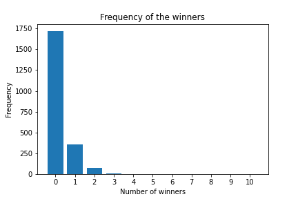

# Joker Statistics
Simple [Joker](https://tzoker.opap.gr/) game statistics. Data collected from the [opap's api](https://www.opap.gr/web-services).

We care only for the 5+1 winners, which means that they correctly selected all numbers and joker.

# Use
## Data collection
To collect the most recent data run the `collectData.py`:
```
python3 collectData.py
```
A file with name `data{drawId}.csv` will be created with the most recent data.

## Statistics
Run the notebook `stats.ipynb` to calculate the stats and the graphs.

Set the variable `dataFile` to the name of the file where the data have been saved (the `data{drawId}.csv` file).

# Results
Maximum drawId of the results: **2172**

Total number of winners: **602**

Total number of draws with at least one winner: **453**

Total number of columns: **8,440,881,572** (columns start been reported from drawId: 647)

Average number of winners: **0.27716390423572745**

Average number of expected winners: **0.22636940578842304**
Average number of real winners over the same period: **0.24311926605504589**

Biggest number of winners: **10** at drawId: 512

Biggest pool money **19,278,990.85** euros, at drawId: 1071 with 3 winners

None jackpot winners: **36** out of 164

Biggest winning spree: **5**
Biggest loss spree: **37**

## Graphs





